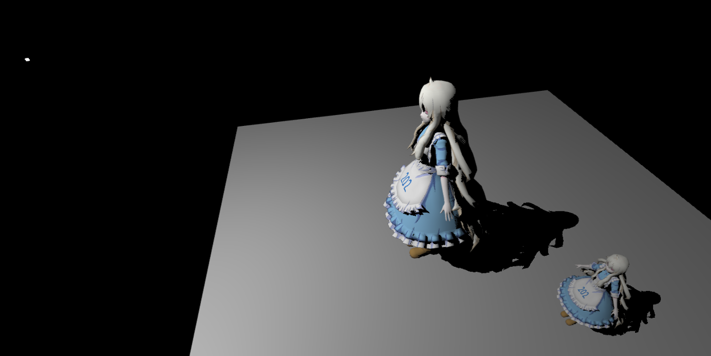
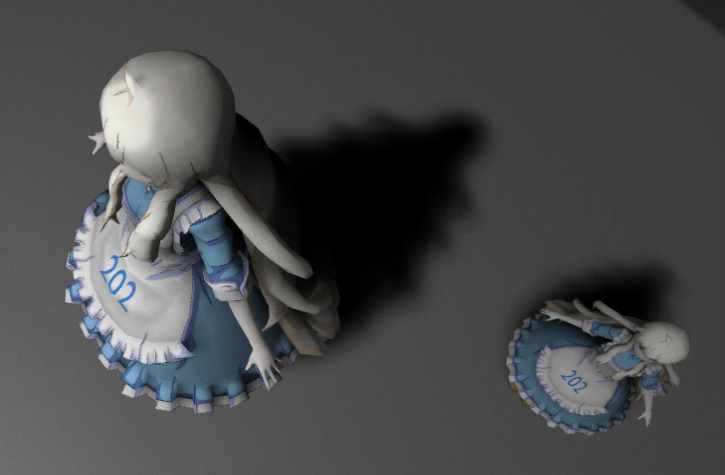
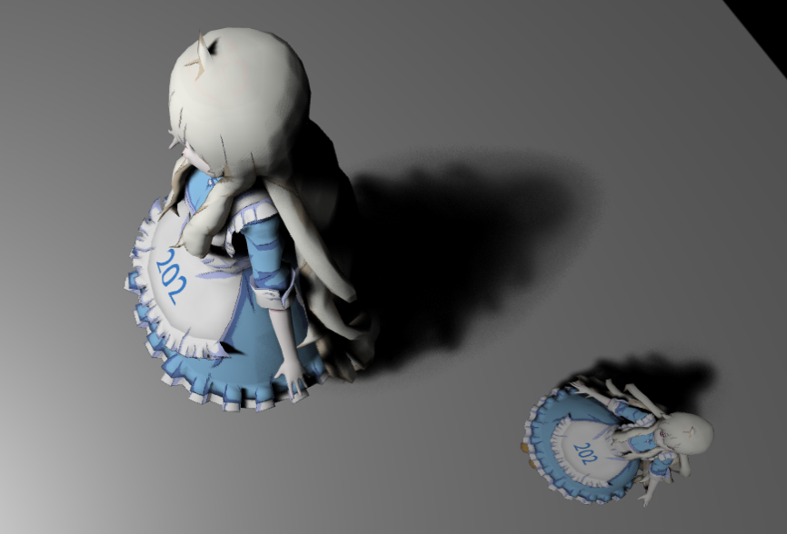

# GAMES202

Homeworks of GAMES202 (Real-Time High Quality Rendering)

### Homework 0: WebGL & Blinn-Phong model

### Homework 1

- Two Pass Shadow Map
  
- PCF (Percentage Closer Filter)
  
- PCSS (Percentage Closer Soft Shadow)
  
